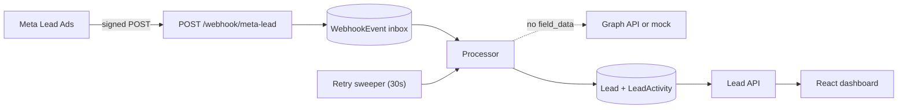

# Lead Intake Service

Receives Meta Lead Ads webhooks, stores leads in PostgreSQL, keeps an audit trail of every change,
and shows them in a React dashboard.

Live: https://leads.himalayandev.tech

I built Meta lead capture earlier for a client project in production and used it as the reference
here, hardened with a signature check, a durable inbox with retries, an audit trail and PII-free logs.

## Architecture



- The signature is checked on the raw body. The event is saved before the 200, so a crash loses
  nothing.
- The processor claims the event atomically and writes the lead. Failures retry every 30 seconds,
  up to five attempts.
- Meta sends only a `leadgen_id`, so details come from the Graph API. If the payload has
  `field_data`, that's used directly. The default provider is a mock, so it runs without Meta
  credentials.

## Audit trail

- `LEAD_CREATED` on the first delivery of a lead.
- `LEAD_UPDATED` when a redelivery has changed values, with a `{ field: { from, to } }` diff. An
  identical redelivery writes nothing.
- `STATUS_CHANGED` when a status moves, with from, to and an optional note.

Every lead write and its activity share one transaction. Activities are never updated or deleted.

## API

| Method | Path | Notes |
|---|---|---|
| `GET` | `/webhook/meta-lead` | Meta handshake |
| `POST` | `/webhook/meta-lead` | Signed delivery |
| `GET` | `/leads` | `page`, `limit`, `status`, `q`, `includeTest` |
| `GET` | `/leads/:id` | Lead, activities, `allowedNextStatuses` |
| `PATCH` | `/leads/:id/status` | `{ status, note? }` |
| `POST` | `/dev/simulate-lead` | Demo only |

Status flow: `NEW → CONTACTED → QUALIFIED → CONVERTED`, any open status can go to `LOST`. Invalid
moves return 409 with the allowed list. Errors look like:

```json
{ "success": false, "message": "Cannot change status from CONTACTED to CONVERTED",
  "statusCode": 409, "errors": [], "requestId": "...", "data": { "allowedNextStatuses": ["QUALIFIED", "LOST"] } }
```

## Run locally

```bash
cp .env.example .env
docker compose up --build
docker compose exec api node dist/seed.js   # 25 demo leads
```

Dashboard at http://localhost:3000, API under `/api`.

## Test the webhook

- Click **Simulate Meta lead** in the dashboard.
- Or use the script. Same id with a changed field shows `LEAD_UPDATED`:

```bash
cd apps/api
npm run webhook:test -- --url http://localhost:3000/api/webhook/meta-lead --leadgen-id 9200000000000001
npm run webhook:test -- --url http://localhost:3000/api/webhook/meta-lead --leadgen-id 9200000000000001 --set city=Pune
```

- Or paste this signed curl (valid with the secret in `.env.example`):

```bash
curl -i -X POST 'http://localhost:3000/api/webhook/meta-lead' \
  -H 'Content-Type: application/json' \
  -H 'X-Hub-Signature-256: sha256=5e64be9afb7c684bdaea161a6b5f9da0b8e531985e50b92b3fd198b94208ed37' \
  -d '{"object":"page","entry":[{"id":"104729384756102","time":1790442176,"changes":[{"field":"leadgen","value":{"leadgen_id":"9100000000000001","page_id":"104729384756102","form_id":"873625194038271","ad_id":"239847561029384","created_time":1790442176,"field_data":[{"name":"full_name","values":["Arjun Menon"]},{"name":"email","values":["arjun.menon@example.com"]},{"name":"phone_number","values":["+919845012345"]},{"name":"city","values":["Bengaluru"]},{"name":"team_size","values":["16-40"]}]}}]}]}'
```

## Tests

```bash
cd apps/api && npm run check   # 48 tests, real Postgres, no DB mocks
cd apps/web && npm run check   # 9 tests
```

They cover signatures, idempotency, update diffs, retries, filters and every status transition,
including concurrent updates.

## Deployment

Runs on my VPS. Host nginx handles HTTPS and proxies to `127.0.0.1:3010`, the only published port.
The API and Postgres stay on the internal Docker network. The web container's nginx serves the
dashboard and forwards `/api/` to the API.

```bash
docker compose -f docker-compose.yml -f docker-compose.prod.yml up -d --build
```

Configs: `deploy/nginx/leads.himalayandev.tech.conf` and `apps/web/nginx.conf`.

## Trade-offs

- Processing runs in the API process with a database retry sweep, not a queue. Simpler at this
  scale.
- Offset pagination. Easy page counts, slower at deep pages.
- No auth. Assumption: the dashboard is internal.
- The API runs migrations on start. Fine for one replica, not for many.

## Scaling

- Move processing to a queue with workers, using `SKIP LOCKED` to claim events.
- Cursor pagination and a read replica for the dashboard.
- Archive old `LeadActivity` and `WebhookEvent` rows.
- Rate limit the webhook and back off on Graph API limits.

## Next

- Auth and roles, with the real user recorded as the activity actor.
- Live updates over SSE instead of polling.
- Lead assignment and notes.
- PII encryption and a retention policy for raw payloads.